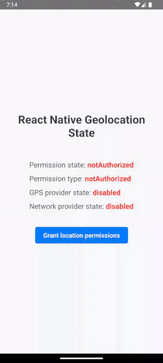

# react-native-geolocation-state

A simple React Native library that helps you keep track of your app’s geolocation permissions and provider status.
It allows you to check the geolocation permissions and whether GPS and network providers are enabled or not, without having to access the user's current location.


## Output



## Installation

Get started by installing the library with npm or yarn:

```sh
npm install react-native-geolocation-state
--- or ---
yarn add react-native-geolocation-state
```


## Geolocation State

The useGeolocationState hook returns a GeolocationState object that describes the current status:

| Key               | Values                                                                       | Description                                                                   |
|-------------------|------------------------------------------------------------------------------|-------------------------------------------------------------------------------|
| `permission`      | `"authorizedWhenInUse"`, `"authorizedAlways"`, `"notAuthorized"`, `"denied"` | Indicates the location permission status.                                     |
| `permissionType`  | `"fine"`, `"coarse"`, `"none"`                                               | Specifies the type of location permission granted.                            |
| `gpsProvider`     | `"enabled"`, `"disabled"`                                                    | Shows whether the GPS provider is enabled or disabled.                        |
| `networkProvider` | `"enabled"`, `"disabled"`, `null`                                            | Shows whether the network provider is enabled or disabled (**Android only**). |


## Usage

### useGeolocationState

A hook that provides access to the current geolocation state. It automatically updates and triggers a re-render when state changes.

#### Example

```typescript
import { useGeolocationState } from 'react-native-geolocation-state';

const TestComponent = () => {
    
    const geolocationState = useGeolocationState();

    useEffect(() => {
        console.log("Geolocation state updated. New state:", geolocationState);
    }, [geolocationState]);
};
```

### forceStateRefresh

The `forceStateRefresh` method manually triggers an update of the geolocation state by fetching the current status through the native module.
This method is a fallback and should be used only in cases where the library fails to automatically detect state changes.


## Contributing

See the [contributing guide](CONTRIBUTING.md) to learn how to contribute to the repository and the development workflow.

## License

MIT

---

Made with [create-react-native-library](https://github.com/callstack/react-native-builder-bob)
